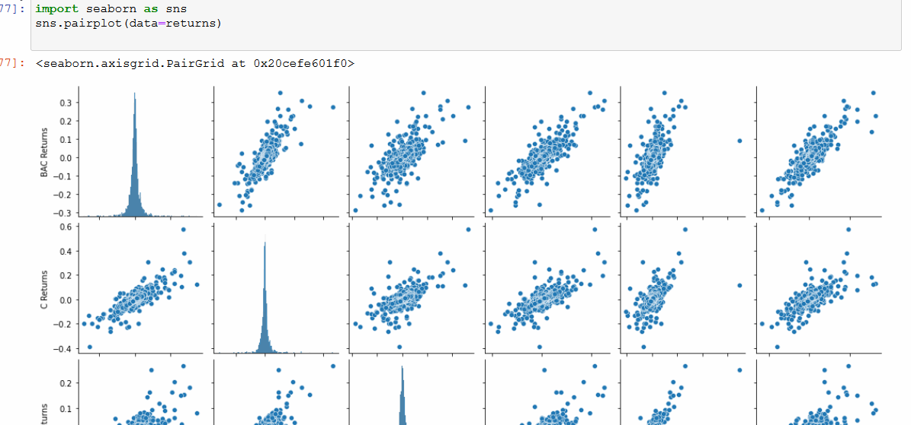

# FinanceDataAnalysis

## 📝 Overview

Analysis on FinanceData focusing on exploratory data analyzation in stock prices from various Banks and compared accordingly. 
Data is scraped from different Banks using pandas datareader.The Banks included are
*  Bank of America
* CitiGroup
* Goldman Sachs
* JPMorgan Chase
* Morgan Stanley
* Wells Fargo
## 🖥️ Installation
### 🛠️ Requirement

* Seaborn
* Matplotlib
* Pandas
* Numpy

    
## ⚙️ Tech Stack

